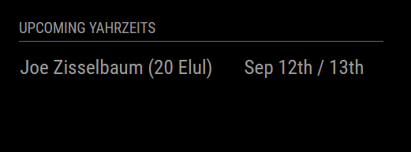

# MMM-Yahrzeit

MagicMirror² module that displays Yahrzeit (anniversary of a death according to the Hebrew calendar). Once configured, the module will display the Yahrzeit dates on your MagicMirror². The dates will be converted to the Hebrew calendar and displayed accordingly.



## Installation

1. Navigate to your MagicMirror's `modules` folder:
    ```bash
    cd ~/MagicMirror/modules
    ```
2. Clone the repository:
    ```bash
    git clone https://github.com/yourusername/MMM-Yahrzeit.git
    ```
3. Navigate to the module's folder:
    ```bash
    cd MMM-Yahrzeit
    ```
4. Install the dependencies:
    ```bash
    npm install
    ```
## Configuration

To use this module, add it to the `modules` array in the `config/config.js` file of your MagicMirror² installation:

```javascript
modules: [
    {
        module: "MMM-Yahrzeit",
        position: "top_right", // This can be any region
        config: {
            // See 'Configuration options' for more information.
            yahrzeits: [
                {
                    name: "Joe Zisselbaum",
                    date: "20 Elul" // DD MM format
                },
                {
                    name: "Abe Genack",
                    date: "13 Tishrei"
                }
            ],
            timezone: "America/New_York", // Timezone for date calculations
            showCount: 5, // Number of Yahrzeits to display
            daysAhead: 30, // Number of days ahead to check for upcoming Yahrzeits
            title: "Upcoming Yahrzeits" // Title to display above the list
        }
    }
]
```

## Configuration Options

| Option                      | Description                                                                 | Default                |
|-----------------------------|-----------------------------------------------------------------------------|------------------------|
| `yahrzeits`                 | An array of objects containing `name` and `date` of the Yahrzeit to display | `[]`                   |
| `timezone`                  | The timezone for date calculations                                          | `America/New_York`     |
| `showCount`                 | The number of Yahrzeits to display                                          | `5`                    |
| `daysAhead`                 | The number of days ahead to check for upcoming Yahrzeits                    | `30`                   |
| `title`                     | The title to display above the list of Yahrzeits                            | `"Upcoming Yahrzeits"` |
| `useEllipsis`               | Whether to use ellipsis for long names                                      | `true`                 |
| `maxCharactersBeforeEllipsis` | The maximum number of characters before adding ellipsis                    | `15`                   |
| `showHebrewDate`            | Whether to display the Hebrew date alongside the Gregorian date             | `false`                |

### Yahrzeit Object

Each object in the `yahrzeits` array should have the following properties:

- `name`: The name of the person whose Yahrzeit is being observed.
- `date`: The date of the Yahrzeit in the Hebrew calendar. Accepted values for the month are:
  - `Nisan`
  - `Iyar`
  - `Sivan`
  - `Tammuz`
  - `Av`
  - `Elul`
  - `Tishrei`
  - `Cheshvan`
  - `Kislev`
  - `Tevet`
  - `Shevat`
  - `Adar`
  - `Adar II` (for leap years)

The date format should be in `DD M` format, where `DD` is the day of the month (a number) and `M` is the Hebrew month (one of the accepted values listed above). There should be a space between the day and the month.

Example:

```javascript
yahrzeits: [
    {
        name: "Joe Zisselbaum",
        date: "20 Elul"
    },
    {
        name: "Abe Genack",
        date: "13 Tishrei"
    }
]
```

## License

This project is licensed under the MIT License - see the [LICENSE](LICENSE) file for details.
